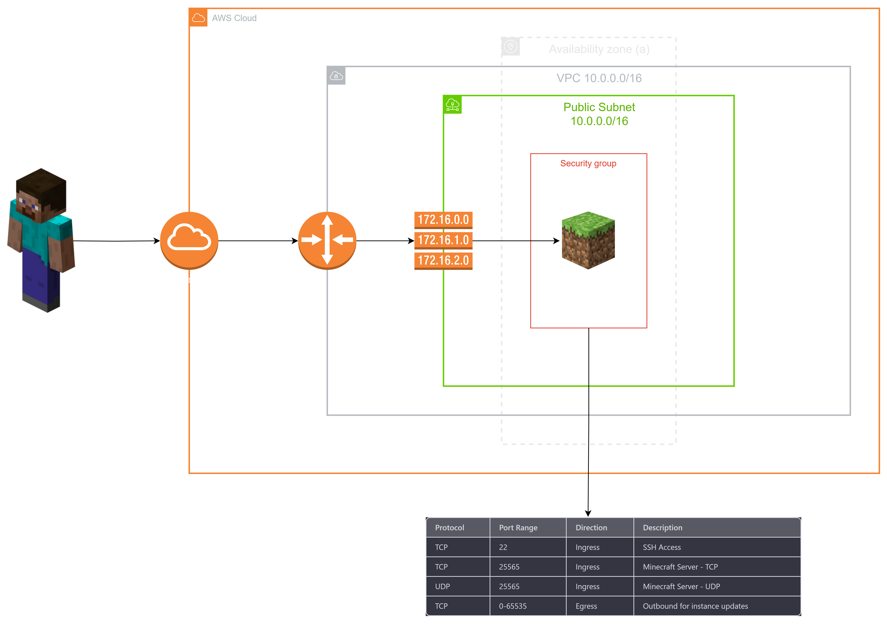

<p align="center">
  
</p>


# Description

Simple Cloud Minecraft Server template based on EC2 and PaperMC.

My intention was to create a server that is easy and fast to deploy maximum amount of automation in the same time.

Work in progress :)

# Architecture Sketch

<p align="center">
  
</p>

# Deploy

## Automated cloud infrastructure deployment

Contains submodule with s3 bucket & dynamodb table for remote backend

```shell
# deploy infrastructure
sh deploy_remote.sh 
```

## SSH and starting the server

## Destroy All Resources
```shell
sh destroy_infrastructure.sh
```

## Pre commit
```
pre-commit install
```
